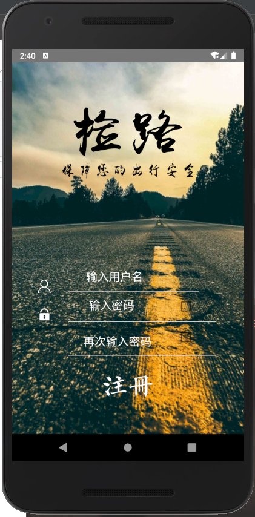

# 检路—基于计算机视觉的道路养护信息采集系统
计设——路面破损信息采集平台

## 项目背景：

> ​		随着我国经济建设的快速发展，道路交通在国民经济建设中扮演的角色越来越重要。随之而来的道路路面的养护和管理问题愈发凸显，其中道路路面的破损检测就成为相关道路养护部分的工作重点之一。另外随着我国一批早期建设的高等级公路进入中修或大修期，为了提高道路的使用寿命，高效获取路面破损的数据就显得尤为重要。路面破损不仅影响路面美观，而且会影响整个道路的使用寿命，当路面开裂后，雨水会通过裂缝渗到路面基层、低基层甚至路基，这样会使混凝土路出现腐蚀，缩短路面的使用寿命并且存在一定的安全隐患。目前，我国的道路路面病害检测方式**仍以人工检测为主**，但是人工检测的方式存在检测效率低，影响正常通行以及工作强度大、耗时、不安全等问题。因此，如果存在一种**快速、安全、高效、低成本**的解决方案，它的意义重大。而本项目正努力往这一点发展。 

## 项目目标：

> ​		本项目旨在为道路养护人员<u>提供一款安全、高效、快速、准确、低成本</u>的路面破损信息采集方案。及时发现路面损坏区域，防止其进一步恶化，**<u>为国家降低道路养护成本。</u>** 

## 目标客户：

> ​		目前，公路养护主要由公路养护部门负责，而我国地理面积大，公路网复杂，如果仅靠道路养护人员做道路检查，则可能很难保证获取信息的时效性。因此本App在设计时充分考虑到这一点，充分利用“自愿者”人群，使普通用户和公路养护部门职员均可通过本App采集信息，而公路养护人员具有管理员权限，可负责用户管理，上报路面破损信息鉴定结果审核等操作。专业和业余的形式，有效的扩宽了数据采集者的人群，为高效采集数据打下了基础。因此本项目主要目标群体为公路养护人员，其次是愿意主动帮助采集路面信息的热心市民。 

# 检路

## 基于计算机视觉的道路养护信息采集系统

## 功能介绍：

|                           作品功能                           |                     效果示意图                     |                     效果示意图                     |                     效果示意图                     |
| :----------------------------------------------------------: | :------------------------------------------------: | :------------------------------------------------: | :------------------------------------------------: |
| 登录注册界面实现，沐界面之浩气，承设计之灵光，我们app设计出了美观、大方的app界面。 |  |  |  |
| app主体功能实现，我们提供了三种推流模式：实时推流、录制本地视频上传、拍照上传。在网络较好的情况下，推荐使用实时推流，如果网络环境较差可以录制本地视频上传，对于普通群众，如果不想录制视频，可以拍照上传得到检测结果。 |  |  |  |
| 权限管理功能，对于普通用户和管理员我们要区别对待，管理员可查看普通用户的权限信息和路面破损信息，普通用户可以申请成为管理员。 |  |  |  |
| 路面破损信息查看，我们结合GPS定位，将坐标与视频的对应位置嵌合，可以通过播放回放查看路面破损情况，对于破损点的处理后结果，点击小图标也可查看。 |  |  |  |
| 本地拍摄的视频会被保存再本地以供查看，管理员可以查看所有的路径的破损信息，实时推流界面如图所示。 |  |  |   |

